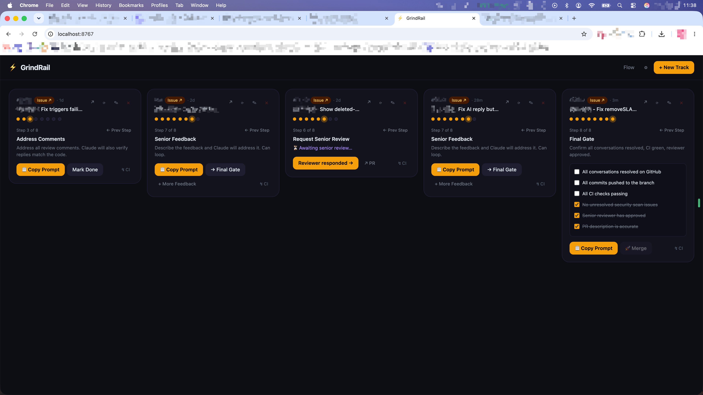

# ⚡ GrindRail

A local web app for tracking pull requests through an AI-assisted review workflow. Every PR, every step, every safeguard.

Built for people who run multiple PRs at once and lose track of where each one is up to.

---

## The name

In Ratchet & Clank, grind rails carry you through a level. Pick the wrong one and you're back at the start. Stay on a looping rail and you never advance.


GrindRail keeps you on the right one — tracking every PR you have in flight, the exact step each one is on, and every safeguard in place before you move on. With AI-generated PRs, it's easy to lose track of where each one is up to.

---

## What it does

GrindRail gives each PR its own card and walks it through an 8-step workflow — from implementation through AI review, senior review, and merge. It connects to GitHub to detect which step a PR is actually on, checks CI status, and posts the four-angle review prompt directly to the PR.

```
1. Implement Fix
2. Trigger AI Review
3. Address Comments
4. Update PR Description
5. Post Evidence
6. Request Senior Review   ← security scan runs here
7. Senior Feedback
8. Final Gate → 🚀 Merge
```

The pipeline can send you back at any step — CI failures, security scan blocks, reviewer feedback loops. GrindRail tracks all of it.



---

## Prerequisites

- Python 3
- A GitHub org with CI checks (GitHub Actions, CircleCI, etc.)
- A GitHub personal access token (classic, `repo` scope)
- Optionally: an issue tracker (Linear, Shortcut, Jira — any URL works) and a workflow doc (Notion, Confluence, etc.)

---

## Setup

```bash
git clone https://github.com/dane-h/grindrail.git
cd grindrail
```

Then either double-click `start.command` or:

```bash
python3 server.py
```

Opens at `http://localhost:8767`.

On first launch, open **Settings** (⚙) and enter:
- **GitHub token** — classic PAT with `repo` scope
- **Workflow doc URL** — optional link to your team's workflow doc, shown in the Flow modal

---

## Stack

- Python 3 stdlib HTTP server — no dependencies
- Single HTML file, vanilla JS, no build step
- State persisted to `data/state.json`
- GitHub REST API for PR details, CI checks, and posting comments

---

## Notes

- `data/` is gitignored — your token and PR state stay local; see `config.example.json` for the expected shape
- Designed to run locally, not deployed
